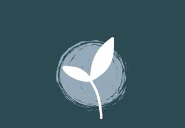

# 🌟 AYRA Welfare Foundation Website

<div align="center">
  
  
  **Empowering Children Through Education & Community**
  
  [](https://inquisitive-swan-00083a.netlify.app)
  [](https://reactjs.org/)
  [](https://www.typescriptlang.org/)
  [](https://tailwindcss.com/)
  [](https://vitejs.dev/)
</div>

---

## 📖 About AYRA Foundation

AYRA Welfare Foundation is dedicated to empowering children through education, awareness, and community support. We believe that every child deserves hope that surpasses just survival—they deserve the power of education, the safety of awareness, and the warmth of a supportive community.

### 🎯 Our Mission
Igniting underserved communities through education, support, and new initiatives.

### 👁️ Our Vision
A world where every child has access to learning and their community believes in their potential.

### 🏆 Our Goal
To break the cycle of educational inequality by creating long-term educational opportunities.

---

## ✨ Website Features

### 🎨 **Modern Design**
- Beautiful gradient backgrounds with teal and dark blue themes
- Responsive design that works on all devices
- Smooth animations and micro-interactions
- Professional typography and spacing

### 📱 **Responsive Layout**
- Mobile-first design approach
- Optimized for tablets, phones, and desktops
- Touch-friendly navigation and interactions

### 🎭 **Interactive Elements**
- Smooth scroll navigation
- Hover effects and transitions
- Animated counters for impact statistics
- Dynamic contact form

### 📊 **Impact Showcase**
- Real-time animated counters
- Visual project gallery
- Community testimonials
- Achievement highlights

---

## 🛠️ Technology Stack

| Technology | Version | Purpose |
|------------|---------|---------|
| **React** | 18.3.1 | Frontend framework |
| **TypeScript** | 5.5.3 | Type safety |
| **Tailwind CSS** | 3.4.1 | Styling |
| **Vite** | 5.4.2 | Build tool |
| **Lucide React** | 0.344.0 | Icons |

---

## 🚀 Quick Start

### Prerequisites
- Node.js (v18 or higher)
- npm or yarn

### Installation

1. **Clone the repository**
   ```bash
   git clone https://github.com/your-username/ayra-foundation-website.git
   cd ayra-foundation-website
   ```

2. **Install dependencies**
   ```bash
   npm install
   ```

3. **Start development server**
   ```bash
   npm run dev
   ```

4. **Open your browser**
   ```
   http://localhost:5173
   ```

### Build for Production

```bash
npm run build
npm run preview
```

---

## 📁 Project Structure

```
src/
├── components/           # React components
│   ├── Header.tsx       # Navigation header
│   ├── Hero.tsx         # Hero section
│   ├── About.tsx        # About section
│   ├── Values.tsx       # Mission, Vision, Goals
│   ├── Projects.tsx     # Project showcase
│   ├── Impact.tsx       # Impact statistics
│   ├── Contact.tsx      # Contact form
│   └── Footer.tsx       # Footer
├── App.tsx              # Main app component
├── main.tsx             # Entry point
└── index.css            # Global styles & animations
```

---

## 🎨 Design System

### Color Palette
- **Primary**: `#2C4A52` (Dark Teal)
- **Secondary**: `#7fb3d3` (Light Blue)
- **Accent**: `#b8d4e3` (Pale Blue)
- **Background**: `#1e3338` (Dark Blue-Green)

### Typography
- **Headings**: Bold, large sizes with proper hierarchy
- **Body**: Clean, readable with good contrast
- **Spacing**: 8px grid system for consistency

### Animations
- Fade in up animations for content reveal
- Slide animations for interactive elements
- Hover effects for better user feedback
- Smooth transitions throughout

---

## 📊 Impact Statistics

<div align="center">

| Metric | Count |
|--------|-------|
| 🎯 **Drives Completed** | 5+ |
| 👥 **Children Impacted** | 250+ |
| 🏢 **Partner Organizations** | 15+ |

</div>

---

## 🤝 Contributing

We welcome contributions to improve the AYRA Foundation website! Here's how you can help:

### Development Guidelines

1. **Fork the repository**
2. **Create a feature branch**
   ```bash
   git checkout -b feature/amazing-feature
   ```
3. **Make your changes**
4. **Test thoroughly**
5. **Commit with clear messages**
   ```bash
   git commit -m "Add amazing feature"
   ```
6. **Push to your branch**
   ```bash
   git push origin feature/amazing-feature
   ```
7. **Open a Pull Request**

### Code Standards
- Use TypeScript for type safety
- Follow React best practices
- Maintain responsive design
- Write clean, commented code
- Test on multiple devices

---

## 📞 Contact & Support

### Get in Touch
- **Email**: ayrawelfarefoundation@gmail.com
- **Phone**: 7007815129
- **Address**: Lucknow
- **Social**: @ayrwelfarefoundation

### Technical Support
For website issues or feature requests, please:
1. Check existing issues
2. Create a new issue with details
3. Include screenshots if applicable

---

## 🙏 Acknowledgments

- **Design Inspiration**: Modern non-profit websites
- **Images**: AYRA Foundation archives
- **Icons**: Lucide React icon library
- **Fonts**: System fonts for optimal performance

---

## 🌟 Show Your Support

If you find this project helpful, please consider:
- ⭐ Starring the repository
- 🐛 Reporting bugs
- 💡 Suggesting new features
- 🤝 Contributing to the codebase
- 📢 Sharing with others

---

<div align="center">
  <p><strong>Made with ❤️ for AYRA Welfare Foundation</strong></p>
  <p><em>Empowering children, one line of code at a time</em></p>
  
  
